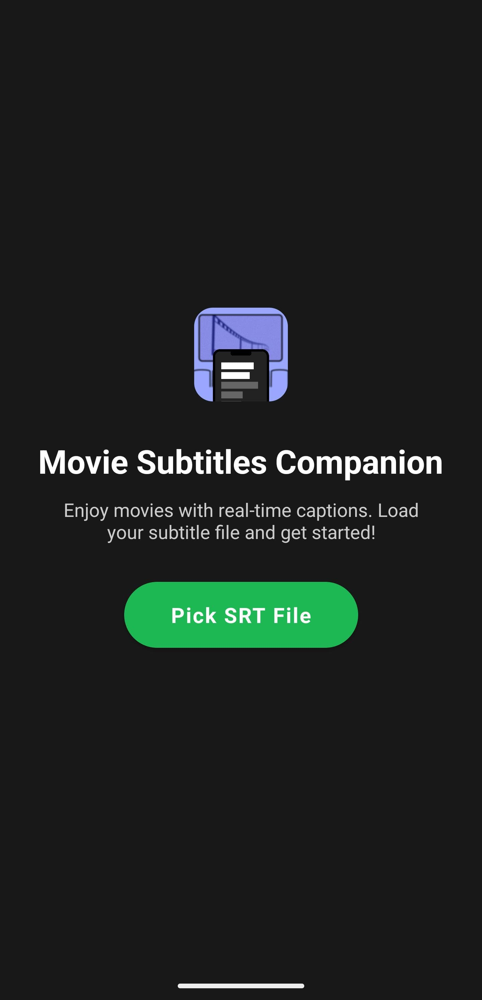
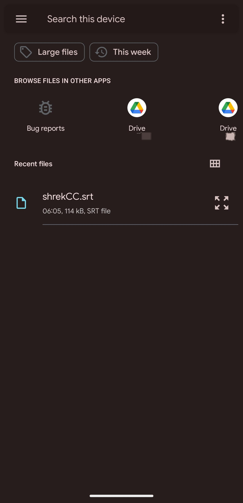
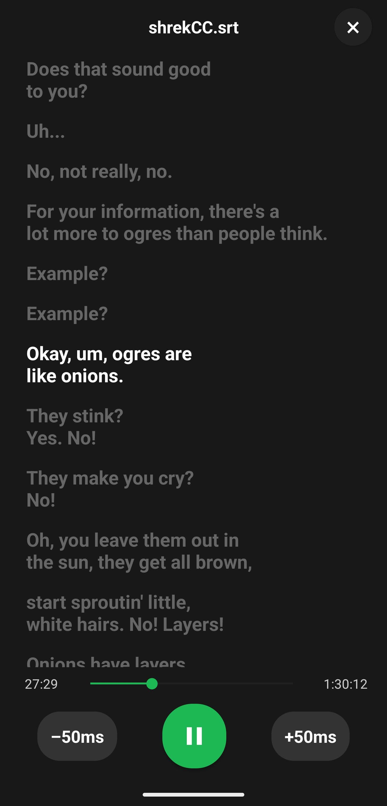

# Movie Subtitles

This app enables users to load external SRT subtitle files and display them in a large, readable, and stylish format, similar to Spotify's lyrics view. The main goal is to provide real-time captions for movies in cinemas where closed captions are not available, making the movie-going experience more accessible.

## How to Use

Download the app from the [Releases](https://github.com/shasherazi/movieSubs/releases/tag/v1.0.0) page. The app is only available for Android devices because I don't own an Apple device (open PR for iOS development).

After downloading and installing the app, follow these steps:

1. Download the SRT subtitle file for the movie you want to watch.
2. Open the app and select the SRT file from your device.

3. Select the SRT file you want to load.

4. The app will display the subtitles in a large, readable format.

5. Profit!
